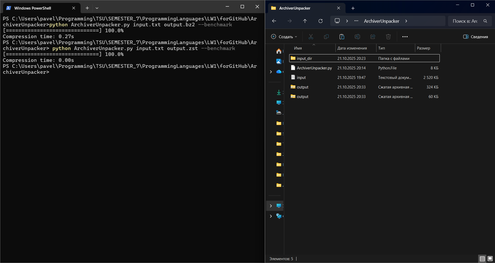
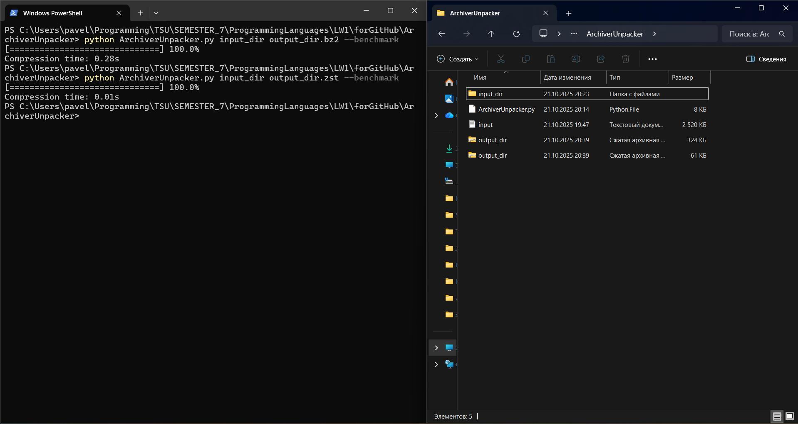
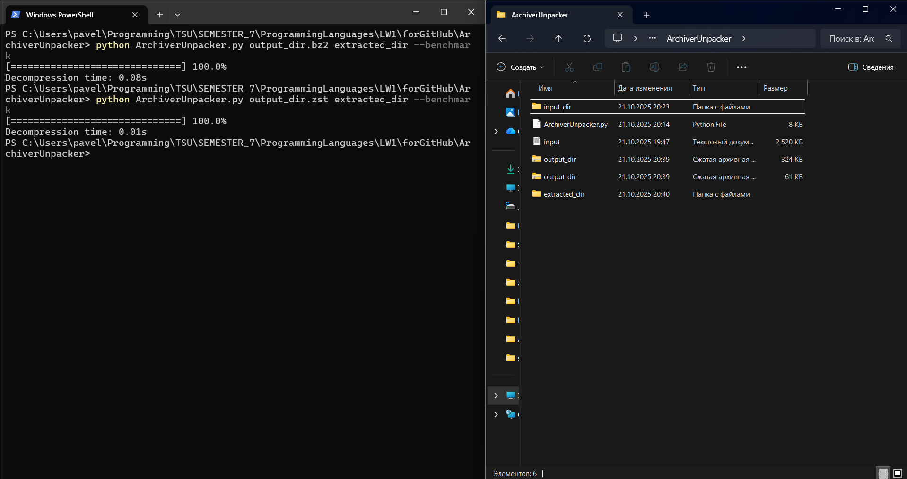

# ArchiverUnpacker

Консольная утилита для архивирования и распаковки файлов и директорий в форматах `.bz2` и `.zst` с поддержкой бенчмарка времени выполнения.

---

## Описание

Утилита умеет:

- Архивировать отдельные файлы или целые директории.
- Распаковывать архивы обратно в файлы или директории.
- Автоматически определять режим (архивация/распаковка) по расширению файла.
- Поддерживает алгоритмы сжатия:
  - `bz2` (bzip2)
  - `zstd` (Zstandard)
- Измерять и выводить время выполнения задачи при использовании ключа `--benchmark`.
- Показ прогресс-бара для наглядного отображения процесса.

Если источник — директория, она сначала упаковывается в `.tar`, а затем сжимается.

---

## Установка

Python 3.14 и выше.  

## Использование

python ArchiverUnpacker.py <src> <dst> [опции]

| Параметр          | Описание                                                |
| ----------------- | ------------------------------------------------------- |
| `src`             | Исходный файл или директория, либо архив для распаковки |
| `dst`             | Целевой файл или директория                             |
| `-b, --benchmark` | Показать время выполнения                               |
| `-h, --help`      | Показать справку по ключам                              |

## Примеры

- Архивация файла в .bz2:

python ArchiverUnpacker.py input.txt output.bz2 --benchmark

- Архивация файла в .zst:

python ArchiverUnpacker.py input.txt output.zst --benchmark

- Распаковка файла из .bz2:

python ArchiverUnpacker.py output.bz2 extracted_file.txt --benchmark

- Распаковка файла из .zst:

python ArchiverUnpacker.py output.zst extracted_file.txt --benchmark

- Архивация директории в .bz2:

python ArchiverUnpacker.py input_dir output_dir.bz2 --benchmark

- Архивация директории в .zst:

python ArchiverUnpacker.py input_dir output_dir.zst --benchmark

- Распаковка директории из .bz2:

python ArchiverUnpacker.py output_dir.bz2 extracted_dir --benchmark

- Распаковка директории из .zst:

python ArchiverUnpacker.py output_dir.zst extracted_dir --benchmark

## Скриншоты работы утилиты

## Архивация файлов

## Распаковка файлов

## Архивация директорий

## Распаковка директорий

